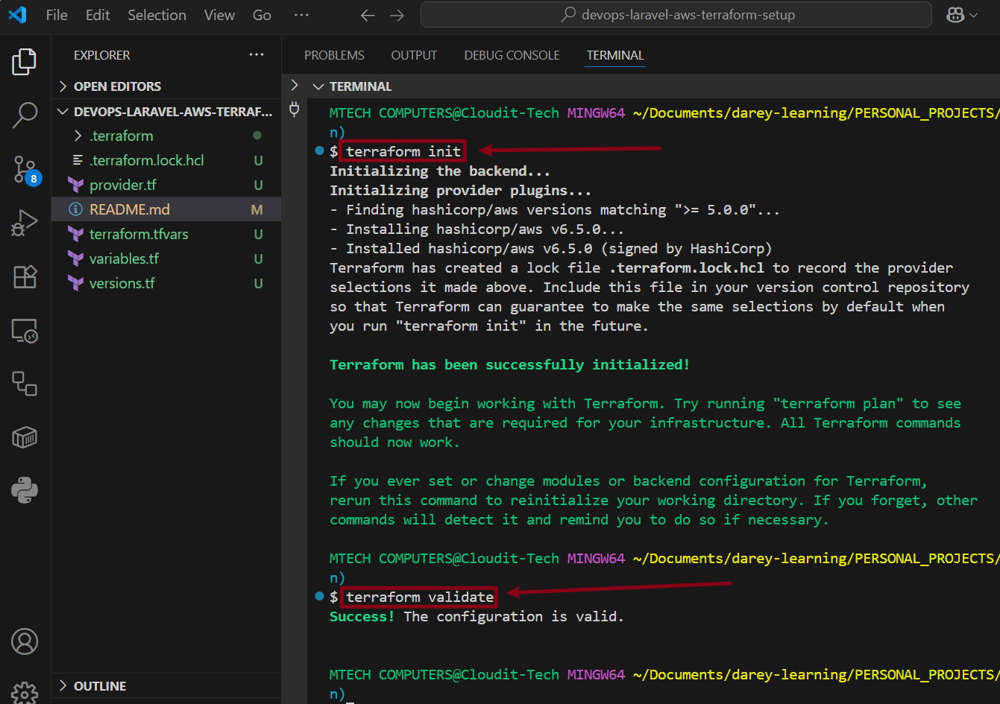
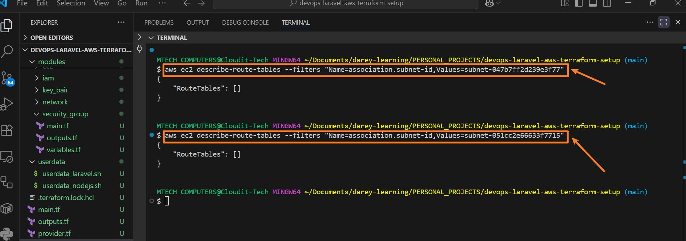

## AWS Laravel Project Setup with Node.js, Livewire, S3, SSL & phpMyAdmin Integration (IaC with Terraform Modules)
### Project Purpose:
To deploy a full-stack Laravel application in a secure, scalable, and automated manner using AWS and Terraform modules. This includes infrastructure setup (VPC, EC2, IAM, S3), application services (Laravel + Node.js), and system tools (phpMyAdmin, SSL via Let’s Encrypt), adhering to DevOps and cloud best practices.
### Tech Stack & AWS Services
| Tool / AWS Service         | Purpose                                         |
|----------------------------|-------------------------------------------------|
| Terraform                  | Infrastructure as Code (IaC)                   |
| EC2 (Ubuntu)               | Host Laravel and Node.js backend              |
| S3                         | Asset and file storage                         |
| IAM Roles/Policies         | Access control for EC2 and S3                  |
| VPC + Subnets              | Custom networking with public/private segmentation |
| MySQL + phpMyAdmin         | Application DB + web UI for DB management      |
| Nginx + SSL (Certbot)      | Web server + secure HTTPS                      |

### Terraform Project Structure (Clean and Modular)

```bash
devops-laravel-aws-terraform-setup/
├── main.tf                # Root module calling all infrastructure modules
├── provider.tf            # AWS provider setup
├── versions.tf            # Required Terraform version and providers
├── variables.tf           # Global variables used in root
├── outputs.tf             # Root outputs
├── terraform.tfvars       # Actual variable values
├── data.tf                # Data sources (AMI, availability zones, etc.)
├── README.md              # Project documentation
└── modules/               # Reusable infrastructure modules
    ├── key_pair/          # Manage SSH key
    ├── network/           # VPC, Subnets, IGW, Route Tables
    ├── security_group/    # Security groups for EC2, DB, etc.
    ├── ec2/               # EC2 instance setup
    ├── iam/               # IAM roles and policies
    ├── s3/                # S3 bucket module
    ├── ssl/               # SSL setup (manual script + outputs)
```

---

### STEP 1: Initialize Root Module & Provider Configuration

#### Purpose:
I will start by setting up the provider and Terraform version requirements. This tells Terraform what cloud environment to work in and ensures compatibility.

#### What I Did:
- Defined AWS provider in provider.tf
- Declared required versions for Terraform and AWS provider
- Parameterized the region
- Prepared a terraform.tfvars to inject values

### CLI Commands:
```bash
terraform init     # Initialize provider and backend
terraform validate # Check for errors
```



---

### STEP 2: Create Key Pair Module

#### Purpose:
To allow secure SSH access to the EC2 instance using a user-managed RSA key pair. The public key will be registered with AWS.

#### What I Did:
- Created a local SSH key
- Wrote a `key_pair` module to import it into AWS
- Used this key for EC2 access later

#### CLI Step (One Time):
```bash
ssh-keygen -t rsa -b 4096 -f ~/.ssh/laravel-key
```


### CLI Commands

```bash
terraform init
terraform plan
terraform apply
```


### Console output


---

### STEP 3: IAM Roles and Policies (`Module: iam`)

#### Purpose:
Enable the `EC2` instance to access services like `S3` securely using instance profiles without hardcoding credentials.

#### What I Did:
- Created an IAM role for EC2
- Attached AmazonS3FullAccess
- Used instance profile in EC2 launch

### CLI Commands

```bash
terraform init
terraform apply
```


### Console output


---

### Step 4: Network Module — `VPC`, `Subnets`, `Internet Gateway`

#### Purpose:
To establish a secure and scalable network foundation by creating a Virtual Private Cloud (VPC) with both public and private subnets, Internet Gateway (IGW), and route tables. This isolates workloads, provides routing for public-facing services, and prepares for scalable infrastructure.

#### What I Did in This Step

| Task                            | Purpose                                                   |
|---------------------------------|------------------------------------------------------------|
| Created VPC                     | Isolates network resources and supports custom subnets.    |
| Created Public & Private Subnets| Allows internet-facing and backend-only services respectively. |
| Configured IGW and Route Table  | Enables routing from public subnets to the internet.       |
| Used variables and output       | To make the module reusable and scalable.                  |

### CLI Commands

```bash
terraform init
terraform apply
```


After adding the output block to the root outputs.tf file, Terraform will be able to expose the value from the module.


### Console outputs


---

### Step 5: Security Group Module

#### Purpose
To create a modular security group that allows:
- Web access via `HTTP/HTTPS`
- SSH access (restricted to Bastion IP or Admin IP)
- Outbound traffic
- Reusability across environments via module

#### What I Did
- Created a `security_group` module inside the `modules/` directory
- Defined `variables`, `main` logic, and `outputs`
- Integrated the module into the **root module**
- Made it configurable using `terraform.tfvars`

### CLI Commands

```bash
terraform init
terraform apply
```


#### Console ouptput


---

### Step 5 – Security Group Module (Extended)

#### Purpose
To define firewall rules that control and restrict access to my infrastructure components.

In this extended step, I:
- Added a new Security Group for MySQL that allows access only from the Laravel app EC2 instance

    > This enforces a least privilege model where each resource is only accessible by its intended consumer — improving both security and scalability.

#### What I Did
I updated the security_group module to now support:
- `mysql_sg`: allows MySQL traffic only from EC2 instance using `web_sg`


### CLI Commands

```bash
terraform apply -auto-approve
```


### Console output


> As shown in the console output, the SQL security group has an inbound rule with the source set to the web_sg.

---

### Step 6 - EC2 Module for Laravel + Node.js

#### Purpose
To provision two EC2 instances on AWS to host:
- **Laravel application** with Livewire, running on a PHP stack (Apache/Nginx + PHP + MySQL client).
- **Node.js background server** for websocket communication or background tasks.

Each instance is deployed in the private subnet, securely accessed via the bastion setup, and connected to the **RDS** database and **S3**.
This step supports core components of the stack:
- Application logic (Laravel + Livewire)
- Background processing (Node.js)
- Secure, scalable architecture with private subnet deployment

#### What I Did

- Created an **EC2 module** that provisions two instances:
  - `Laravel EC2` (**app server**) tagged `laravel-ec2`
  - `Node.js EC2` (**background server**) tagged `nodejs-ec2`

- Attached the `web_sg` security group to allow:
  - `HTTP/HTTPS` access from the internet
  - SSH access from my local machine via bastion
- Enabled remote access through **key pair**
- Placed instances inside **private subnets** for security
- Defined **outputs** to reference EC2 instance IDs and private IPs
- **Included separate startup scripts (user data) for automated provisioning:**
  - `userdata_laravel.sh` Installs Apache, PHP, Composer, and Laravel, and sets up a **simple Laravel starter app** included in the project repo for quick testing.

  - `userdata_nodejs.sh` Installs Node.js, npm, PM2, and runs a **simple Node.js** worker app also included in the project repo.

#### Simple apps included in the repo

- **Laravel Starter App:** A minimal Laravel 10.x app with Livewire installed, ready to run and demonstrate core Laravel functionality.
  > You can find the full project on [Laravel-Starter-APP-Repo](https://github.com/idokochukwudi/laravel-starter-app).
- **Node.js Worker App:** A minimal Node.js script that logs a message every 10 seconds, demonstrating background task processing with PM2.
  > For detailed steps on setting up Node.js used in this application, refer to the [Starter App Node.js REPO](https://github.com/idokochukwudi/node-worker-app).

### 📄 Additional Documentation

- [Install Composer on Windows](./docs/install_composer_windows.md)

### CLI Commands

```bash
terraform fmt
terraform init
terraform apply -auto-approve
```


### Console output


---

### Step 6 (Extended) – Provision Bastion Host & Update Security Groups

#### Purpose
- Provision a **Bastion Host EC2 instance** in the `public subnet` to securely access EC2 instances in private subnets.
- Update the **Web App EC2 security group** to allow SSH access **only from the Bastion Host’s security group** instead of my `local IP`, enabling a secure SSH jump.
- Use `terraform.tfvars` for flexible, environment-specific configuration (AMI, instance types, subnet IDs, CIDR blocks, etc).
- Maintain principle of least privilege by restricting SSH access tightly through Bastion.

### What I Did

#### 1. Extended EC2 Module:
- Added new variables for Bastion host configuration:  
  `create_bastion`, `bastion_instance_type`, `bastion_ami_id`, `bastion_subnet_id`, `bastion_sg_id`.
- Created a **separate EC2 resource** for the Bastion host that launches only if `create_bastion` is set to `true`.
- Added outputs for Bastion instance ID and public IP in the EC2 module outputs (without using deprecated `condition` argument).

#### 2. Updated Security Groups Module:
- Created a `bastion_sg` security group allowing SSH inbound **from my local machine's public IP CIDR block** (set via `terraform.tfvars` as a list).
- Updated the `web_sg` security group to allow SSH inbound **only from the Bastion security group** (using `source_security_group_id` to reference Bastion SG), removing direct SSH access from local IPs.

#### 3. Updated root module `main.tf`:
- Added a separate module call for the Bastion EC2 instance using the same EC2 module with Bastion-specific variables.
- Passed Bastion variables via tfvars: AMI, instance type, public subnet ID, Bastion SG ID.
- Enabled Bastion host creation via `create_bastion = true`.
- Updated references so the app EC2 instance uses the private subnet and security groups appropriately.
- Updated Security Group module call to include the Bastion CIDR blocks as a **list of strings**.

#### 4. Updated `terraform.tfvars`:
- Defined `bastion_cidr` as a list, e.g. `["197.211.57.13/32"]` to represent my local IP.
- Set `bastion_ami_id` with the Bastion host AMI.
- Set `bastion_instance_type` for the Bastion host.
- Set `bastion_subnet_id` as one of the public subnet IDs.
- Enabled Bastion host creation with `create_bastion = true`.

---

### This setup ensures:
- Bastion host is publicly accessible with a public IP in the public subnet.
- App EC2 instances are launched in private subnets without public IPs.
- SSH access to app instances is restricted to the Bastion host only.
- Bastion host SSH access is limited to my local IP CIDR.
- Configurations are flexible and environment-agnostic via `tfvars`.


### CLI Commands

```bash
terraform fmt
terraform init
terraform apply -auto-approve
```


### Console output


### Step 7 – SSH Access and Verifying App Server Setup

#### Purpose
- SSH into the **Bastion Host** (which has a public IP) using my `.pem` private key.
- From Bastion, SSH into my **App EC2 Instances** (private subnet).
- Verify that the user **data script** executed correctly **only on the App EC2 instances**.

#### Step 1 – Locate and Secure my Private Key

Ensure my private key file exists and has proper permissions:

```bash
ls -l ~/.ssh/<key_name>
```
If it's there, change the permissions:

```bash
chmod 400 ~/.ssh/<key_name>
```


#### Step 2 – SSH into the Bastion Host

Use the public IP of my Bastion EC2 instance from the Terraform output or from the aws console:

```bash
ssh -i ~/.ssh/laravel-key ec2-user@<BASTION_PUBLIC_IP>
```
> Replace <BASTION_PUBLIC_IP> with my actual IP (e.g. 98.80.172.105)


#### Step 3 – From Bastion, SSH into App Servers

First, copy my private key into the Bastion Host:

On my local machine, run:

```bash
scp -i ~/.ssh/laravel-key ~/.ssh/laravel-key ec2-user@<BASTION_PUBLIC_IP>:~/.ssh/laravel-key
```


Then, from inside the Bastion Host:

```bash
chmod 400 ~/.ssh/laravel-key
ssh -i ~/.ssh/laravel-key ec2-user@<PRIVATE_APP_IP>
```
> Replace <PRIVATE_APP_IP> with the private IP of my App server (from AWS Console or Terraform output).


#### Step 3 – Verify App EC2 User Data Execution

Once you're inside the App instance, check the user data logs:

```bash
sudo cat /var/log/cloud-init-output.log
```

#### User Data Script Did Not Run on EC2 Instance

> EC2 User Data Script Failed to Execute on Instance Launch

After launching the EC2 instance, it was observed that the user data script did not execute. This was confirmed by accessing the instance via SSH and reviewing the system state and logs.

## Verification Steps
### 1. SSH Access to Instance:

- Accessed the EC2 instance via SSH (through Bastion Host)
- Manually checked for signs of script execution.

### Observation:

- No expected changes were present on the instance.
- For example, no custom files or configurations were applied.
- No services (like Apache) were installed, and no application files were in place.

### 2. User Data Logs Checked:

```bash
sudo cat /var/log/cloud-init-output.log
sudo cat /var/log/cloud-init.log
```

- Logs did not contain any evidence that the user data script was run.
- No output or error related to the commands in the script.

### User Data Presence Confirmed

The user data was confirmed to be attached to the instance using the following command:

```bash
aws ec2 describe-instance-attribute \
  --instance-id i-0996fab04bbc62a33 \
  --attribute userData \
  --query "UserData.Value" \
  --output text | base64 --decode
```

> The decoded script was correct and matched the expected content, confirming that user data was present but did not execute.

### Solution Documentation: Enabling User Data Execution on EC2 Instance in Private Subnet Using NAT Gateway (Terraform Module Approach)

### 1. Background and Problem Statement

- I have an EC2 instance running in a **private subnet** inside my **VPC**.
- The instance runs a **user data script** on launch that requires internet access (e.g., **apt updates, git clone, composer install**).
- The user data script did not execute properly because the instance lacks internet access.
- Diagnosis confirmed the private subnet does not have a route to the internet (no **NAT Gateway** or **internet gateway route**).

### 2. Diagnosis Steps and Findings

Using AWS CLI, the following commands and their results helped identify the issue:

- **Check route tables associated with private subnets:**

  ```bash
  aws ec2 describe-route-tables --filters "Name=association.subnet-id,Values=subnet-xxxxxxx"
  ```

  

  > Result: No route tables associated with private subnet or no default route (0.0.0.0/0) to internet/NAT gateway.

- **Check main route table for VPC:**

```bash
aws ec2 describe-route-tables --filters "Name=vpc-id,Values=vpc-xxxxxxx" --query 'RouteTables[?Associations[?Main==`true`]]'
```


> Result: Only local routes (10.0.0.0/16 → local), no internet gateway or NAT gateway routes for private subnet.

This route allows **all subnets inside my VPC to talk to each other** by routing traffic within the VPC, without needing to go through an internet gateway or NAT device.

### 3. Solution Overview

- Add a **NAT Gateway** in a **public subnet** to allow instances in private subnet to access the internet.
- Create a **private route table** with a default route (`0.0.0.0/0`) pointing to the NAT Gateway.
- Associate the private subnet with this private route table.
- Confirm security groups allow outbound traffic (they already allow all outbound).
- This allows the EC2 instance in the private subnet to run user data scripts successfully.

### Implementation Details

**NOTE:** First of all I also confirmed if Internet Gateway is already attached to my VPC

```bash
aws ec2 describe-internet-gateways \
  --filters "Name=attachment.vpc-id,Values=<my-vpc-id>"
```


> From the output, the Internet Gateway is already attached to my VPC.

### 1. Update my Network Module `main.tf` with the following:

```bash
# Allocate Elastic IP for NAT Gateway
resource "aws_eip" "nat_eip" {
  vpc = true

  tags = {
    Name = "${var.project}-nat-eip"
  }
}

# Create NAT Gateway in Public Subnet
resource "aws_nat_gateway" "nat" {
  allocation_id = aws_eip.nat_eip.id
  subnet_id     = var.public_subnet_id
  depends_on    = [aws_internet_gateway.igw]

  tags = {
    Name = "${var.project}-nat-gateway"
  }
}

# Create Private Route Table
resource "aws_route_table" "private_rt" {
  vpc_id = var.vpc_id

  tags = {
    Name = "${var.project}-private-route-table"
  }
}

# Create Route for Private Route Table to NAT Gateway
resource "aws_route" "private_nat_route" {
  route_table_id         = aws_route_table.private_rt.id
  destination_cidr_block = "0.0.0.0/0"
  nat_gateway_id         = aws_nat_gateway.nat.id
}

# Associate Private Subnet with Private Route Table
resource "aws_route_table_association" "private_subnet_assoc" {
  subnet_id      = var.private_subnet_id
  route_table_id = aws_route_table.private_rt.id
}
```

### 2. Update my Network Module variables (`variables.tf`):

```bash
variable "vpc_id" {
  description = "VPC ID"
  type        = string
}

variable "public_subnet_id" {
  description = "Public subnet ID for NAT Gateway"
  type        = string
}

variable "private_subnet_id" {
  description = "Private subnet ID for route table association"
  type        = string
}

variable "project" {
  description = "Project name for tagging resources"
  type        = string
}
```

### 3. Pass variables when calling the module in my root Terraform config:

```bash
module "network" {
  source           = "./modules/network"
  vpc_id           = aws_vpc.main.id
  public_subnet_id = aws_subnet.public[0].id
  private_subnet_id = aws_subnet.private[0].id
  project          = var.project
}
```

### 4. Security Group Review

My existing security groups allow all outbound traffic and the necessary inbound traffic.

### 5. Post-Deployment Verification
Before applying the Terraform changes, I ran a clean-up to ensure the infrastructure would provision from scratch without conflicts or leftover resources:

```bash
terraform destroy -auto-approve
```

This helped avoid issues with partial or conflicting resources from previous runs.

Then, to deploy the updated infrastructure with the new NAT Gateway and related networking configurations, I ran:

- Apply the Terraform changes:
  
  ```bash
  terraform init
  terraform apply
  ```

  

## Summary of Issues and Solutions Encountered

- **Error: Missing required argument "`vpc_id`" in network module**

  This was because the root module was trying to pass aws_vpc.main.id which is declared in the child network module, not in the root module.
  
  **Solution:** Remove `vpc_id` from the root module’s arguments and instead output the VPC ID from the network module and reference it where needed (e.g., security group module).

- **Error: Reference to undeclared resources like `aws_subnet.public` in root module**

  The root module was referencing subnet resources that only exist inside the network module.

  **Solution:** Pass subnet CIDRs (or subnet IDs as outputs) as variables and outputs between modules instead of referencing resources directly across modules.

- **Error: Passing list to string variables (e.g., public_subnet_id expecting string but receiving list)**

  Terraform expects type consistency.
  **Solution:** Adjust variable types in the network module to list(string) or pass a single element (e.g., `public_subnet_ids[0]`) depending on the use case.

- **Error: Unsupported argument vpc = true in aws_eip resource**

  Terraform version update or provider version changes sometimes deprecate or remove arguments.

  **Solution:** Remove or update the argument to comply with the current AWS provider version documentation.

## Post-NAT Gateway Verification & Application Bootstrapping (Laravel & NodeJS) via User Data

### Objective
To confirm that, after provisioning a **NAT Gateway** and updating the **route table**, the EC2 instances in **private subnets** now:
- Can access the internet.
- Successfully execute their respective **User Data scripts** on launch:
  - One for **Laravel (PHP/Apache)**
  - One for **NodeJS App**

### Prerequisites Recap

From previous deployment fixes:

- NAT Gateway was created in a **public subnet**.
- A **private route table** was added with a default route (`0.0.0.0/0`) pointing to the NAT Gateway.
- The **private subnet** hosting our Laravel and NodeJS EC2 instances was associated with this new route table.
- Security groups allow:
  - SSH from Bastion to private EC2s.
  - All outbound traffic for internet access.

## Validation of Laravel and NodeJS App 

### 1. SSH Access into Bastion Host (Public Subnet)
On my local machine:

```bash
ssh -i ~/.ssh/laravel-key.pem ec2-user@<BASTION_PUBLIC_IP>
```


> **Success:** I'am now in the Bastion Host.

### 2. SSH Access from Bastion → Laravel EC2 (Private Subnet)

```bash
ssh -i ~/.ssh/laravel-key ec2-user@<LARAVEL_PRIVATE_IP>
```

- You will get a fingerprint prompt on first connection — accept it.
- **If permission denied:**
  - Ensure the key file has chmod 400
  - Confirm correct ec2-user (Amazon Linux), or use ubuntu (Ubuntu OS)

  

  > **Success:** I'm now inside the Laravel EC2 instance.

## Validate Laravel App Setup from User Data

### 1. Check if user data log exists:

```bash
sudo cat /var/log/cloud-init-output.log
```
**Expected log output:**

Look for lines like:

```vbnet
Cloning into 'laravel-app'...
Generating application key...
Restarting apache2...
```

### 2. Confirm Apache is running:

```bash
sudo systemctl status apache2
```

---

## Laravel UserData Installation Failure & Manual Installation Recovery

### Background
During the provisioning of a Laravel application on a private **EC2 instance** (reachable only via a **Bastion Host**), the initial plan was to automate the Laravel installation using the **EC2 user data script**. This script was intended to:

- Update the server
- Install PHP, NGINX, Composer, and required extensions
- Clone the Laravel project from GitHub
- Install Composer dependencies
- Set proper permissions and environment variables
- Configure NGINX

### ❌ Problem Encountered: UserData Script Not Installing Laravel
Despite the user data script being attached correctly to the EC2 Launch Template, Laravel did not install properly. The web server returned a blank page or NGINX default index, and Laravel-specific files (e.g., .env, vendor/, etc.) were missing.

## Summary of Troubleshooting Attempts

- Verified that user data was base64-encoded and correctly attached in the Terraform configuration.
- Confirmed the GitHub repository containing the Laravel Starter App (which I personally created) was public and could be cloned without requiring SSH keys.
- Ensured the script included all necessary commands, including `git clone`, `composer install`, and `php artisan key:generate`.
- Checked logs using `sudo cat /var/log/cloud-init-output.log` and `/var/log/user-data.log` to trace script execution and errors.
- Confirmed the EC2 instance had internet access via the NAT Gateway for installing packages and pulling dependencies.
- Made multiple script adjustments, such as correcting working directory paths, inserting `sleep` intervals to allow services time to start, and manually testing sections of the script via SSH.
- Switched the instance’s AMI and web server from Apache to **Nginx**, suspecting compatibility or startup conflicts with Laravel.
- At a point, replaced the complex user data script with a **simplified Apache/Nginx installation script that only served a static web page** — and **this worked successfully**, confirming that user data execution itself was functional.
- However, when I eventually reverted back to the original Laravel setup script, **it still failed**, indicating the issue was tied specifically to the Laravel configuration process within the user data script, not the infrastructure or instance itself.
  
  ```bash
  sudo cat /var/log/cloud-init-output.log
  ```
  > **Result:** Cloud-init exited without completing Laravel steps.

  > ⚠️ Tried replacing apt with apt-get, and ensuring packages were installed before Laravel setup — still failed.

  > ⚠️ Even when trimmed down, Laravel install commands silently failed due to lack of permissions and sometimes network timeouts.

#### Manual Installation:  (Inside the Instance)
After repeated failure using automation, the decision was made to manually SSH into the instance through the Bastion Host and run a script to set up Laravel successfully.

## Access via Bastion Host

### Step 1: Create the Script
SSH into the private instance through the Bastion, then:

```bash
ssh -i bastion-key.pem ec2-user@<bastion-public-ip>
ssh -i private-instance-key.pem ec2-user@<private-instance-private-ip>
```


### Manual Setup Script: `install_laravel.sh`

```bash
nano install_laravel.sh
```
Paste the following content:

```bash
#!/bin/bash

# Enable logging
exec > /var/log/user-data.log 2>&1
set -e

# Step 1: Update the System
sudo yum update -y

# Step 2: Enable EPEL and Install Required Packages
sudo amazon-linux-extras enable php8.1
sudo yum clean metadata
sudo yum install -y nginx php-cli php-fpm php-mbstring php-xml php-bcmath php-curl php-mysqlnd unzip curl git mysql

# Step 3: Start & Enable PHP-FPM and NGINX
sudo systemctl enable php-fpm
sudo systemctl enable nginx
sudo systemctl start php-fpm
sudo systemctl start nginx

# Step 4: Install Composer
cd ~
curl -sS https://getcomposer.org/installer | php
sudo mv composer.phar /usr/local/bin/composer

# Step 5: Clone Laravel Project
sudo mkdir -p /var/www
cd /var/www
sudo git clone https://github.com/idokochukwudi/laravel-starter-app.git laravel-app

# Step 6: Set Permissions
cd laravel-app
sudo chown -R apache:apache /var/www/laravel-app
sudo chmod -R 775 storage bootstrap/cache

# Step 7: Install Laravel Dependencies
sudo -u apache composer install --no-interaction --prefer-dist --optimize-autoloader

# Step 8: Set Up .env File
sudo cp .env.laravel-node .env
sudo -u apache php artisan key:generate

# Step 9: NGINX Configuration
sudo tee /etc/nginx/conf.d/laravel.conf > /dev/null <<EOF
server {
    listen 80;
    server_name _;

    root /var/www/laravel-app/public;
    index index.php index.html;

    location / {
        try_files \$uri \$uri/ /index.php?\$query_string;
    }

    location ~ \.php\$ {
        include /etc/nginx/fastcgi_params;
        fastcgi_pass unix:/run/php-fpm/www.sock;
        fastcgi_index index.php;
        fastcgi_param SCRIPT_FILENAME \$document_root\$fastcgi_script_name;
    }

    location ~ /\.ht {
        deny all;
    }
}
EOF

# Step 10: Restart Services
sudo systemctl restart php-fpm
sudo systemctl restart nginx

# Done
echo "Laravel app deployed successfully on Amazon Linux 2 with NGINX!"
```

 ### Step 2: Make It Executable

 ```bash
 chmod +x install_laravel.sh
 ```
### Step 3: Run It

```bash
./install_laravel.sh
```
----

## Summary of Laravel Setup on Amazon Linux 2023 EC2 Instance

### Initial Setup & Automation
- Provisioned an Amazon Linux 2023 EC2 instance.
- Created a bash installation script (`install_laravel.sh`) to automate setup of required software:
  - System update, installation of Nginx, PHP 8.4 with necessary extensions, MariaDB connector, Git, and Composer.
  - Enabled and started Nginx and PHP-FPM services.
  - Installed Composer globally for PHP package management.
  - Cloned Laravel starter app from GitHub into /var/www/laravel-app.
  
## Challenges Encountered and Solutions

### Package Installation Issues:
- `mysql` and `mariadb` packages were not found in Amazon Linux 2023 repositories.
**Solution:** Replaced with `mariadb-connector-c` which provides the necessary client libraries compatible with Laravel.

### Permission Denied Errors for .env file:
- Running `php artisan key:generate` failed with `file_put_contents():` Permission denied on `.env.`
**Solution:** Explicitly changed ownership of `.env` to apache user and set writable permissions before generating the app key.

### Git Clone Fails When Directory Exists:
- The clone step failed because `/var/www/laravel-app` already existed from previous runs.
**Solution:** Added a cleanup command to remove any existing `laravel-app` directory before cloning.

### Final Steps
- Set directory permissions and ownership properly for the apache user to ensure the web server and Laravel can read/write necessary files and directories.
- Configured Nginx to serve the Laravel app from the public directory and linked PHP-FPM socket.
- Restarted services to apply configuration.
- Successfully completed Laravel installation, dependencies installation, and key generation.


---

## Node.js Installation (Amazon Linux)

For full documentation on how Node.js was installed using a script (`install_nodejs.sh`), including the problem encountered with the `UserData` method and the manual recovery steps, click the link below:

➡️ [Install Node.js on Amazon Linux](./docs/NodeJS_Installation_Documentation.md)


---

## User Data Script Update and Validation (Amazon Linux 2023)

After manually troubleshooting and successfully installing Laravel on the EC2 instance, I identified and resolved issues in the original user_data script. The updated script incorporated several necessary corrections, including:

- Ensuring correct package installation with --allowerasing
- Proper service enablement and permissions for Laravel directories
- Accurate configuration for nginx with PHP-FPM socket
- Use of apache user for Composer and Artisan commands

### Updated User Data Script
The corrected `userdata_laravel.sh` script was added to the user_data field in the Terraform EC2 configuration.

To reflect this, I replaced the old user data in the Terraform EC2 resource with the updated script:

> The script used is available at: `userdata/install_laravel.sh`

## Reapplying Terraform

After replacing the broken user data with the updated version, I ran:

```bash
terraform apply
```
> This **successfully reprovisioned** the EC2 instance using the new user_data without any manual intervention.

## Confirming Laravel Application and Services

After provisioning, I SSHed into the instance and ran the following commands to verify Laravel was installed correctly via the script:


### 1. Confirm Nginx and PHP-FPM Services

- #### `sudo systemctl status nginx`

  

- #### `sudo systemctl status php-fpm`

  

### 2. Check Nginx Configuration

```bash
sudo nginx -t
```


### 3. Curl Application (from inside EC2)

```bash
curl http://localhost
```


## Reference to Updated `Node.js` Installation Documentation
After replacing the original user data script with the updated script derived from the successful manual installation process, the **Node.js environment** was provisioned correctly and the application started without issues.

For detailed steps and further reference, please consult the Node.js installation and setup documentation available here:
[Node.js Installation Guide Using User Data Script](./docs/NODEJS_UserData_Script_Update_and_Validation.md)


## Outcome
The **Laravel application** was **successfully** installed and running using only **user data**, eliminating the need for **manual setup**.

Similarly, the **Node.js server** was deployed and verified using an updated **user data script** adapted from the manual installation approach, confirming its effectiveness for automating **Node.js application** provisioning.

This experience helped validate both the `userdata_laravel.sh` and the `userdata_nodejs.sh` user data scripts, revealing critical troubleshooting insights that significantly improved the reliability and consistency of the automated provisioning process.


