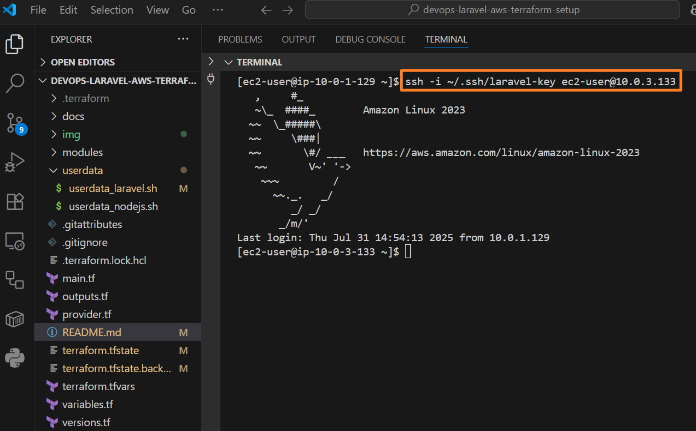
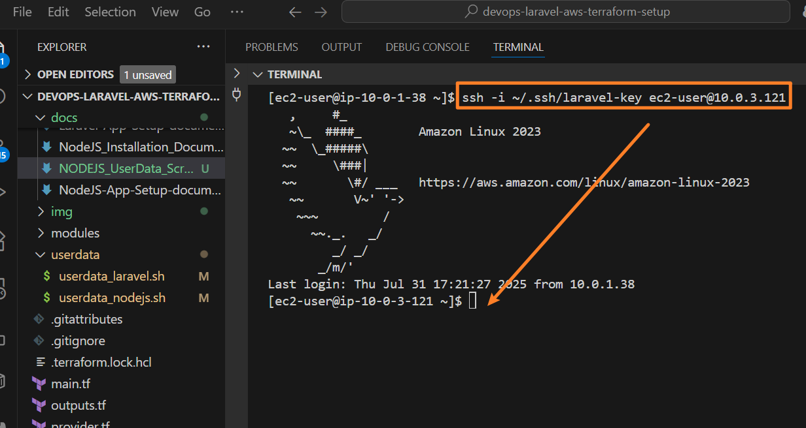
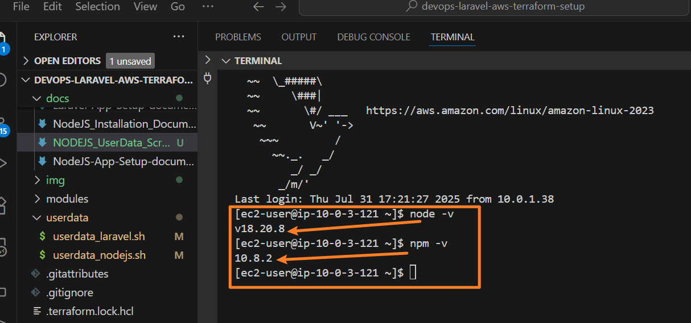
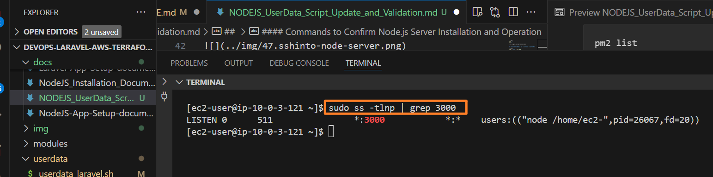
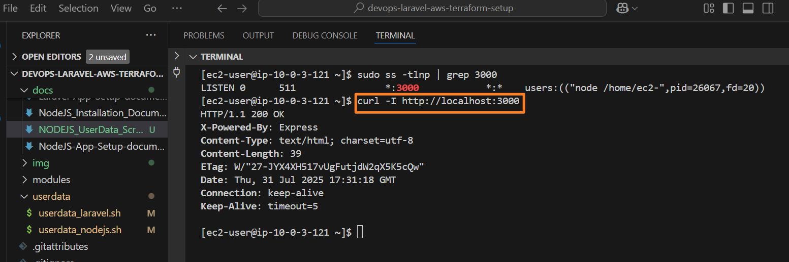
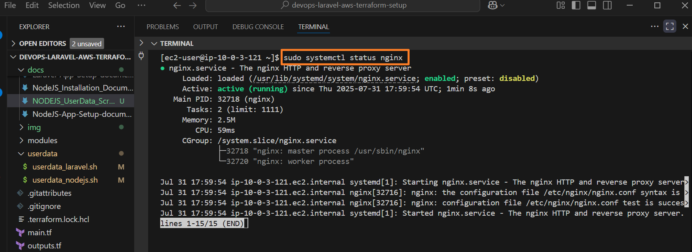
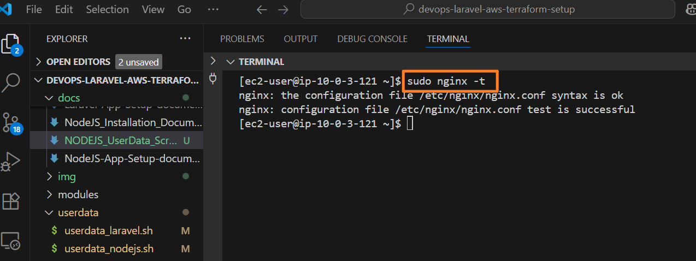

## Node.js Server Deployment Documentation

### Overview

This document outlines the process of deploying the Node.js worker server on Amazon Linux 2023 EC2 instance using a user data script. The steps include manually troubleshooting the installation, updating the user data script, and verifying the successful deployment of the Node.js server and related services.

---

#### User Data Script Update and Validation (Node.js Server)

After manually troubleshooting and successfully installing the Node.js worker on the EC2 instance, I identified and resolved issues in the original `user_data` script. The updated script incorporated several necessary corrections, including:

- Installing Node.js 18 from NodeSource
- Cloning the Node.js worker app repository
- Installing app dependencies with `npm install`
- Installing and configuring PM2 to manage the Node.js process
- Configuring Nginx as a reverse proxy to the Node.js app listening on port 3000
- Enabling and starting necessary services

---

#### Applying the Updated User Data Script

The corrected `userdata_nodejs.sh` script was replaced in the Terraform EC2 resource user data section. After replacement, I ran:

```bash
terraform apply
```

This successfully reprovisioned the EC2 instance with the updated user data script, automating the Node.js worker deployment.

---

#### SSH Into Node.js Server

Once provisioning completed, I connected to the EC2 instance via SSH:

```bash
ssh ec2-user@<NODE_SERVER_IP>
```

---

**NOTE:** My IP changed, so I had to re-provision the server:



#### Commands to Confirm Node.js Server Installation and Operation

1. **Check that Node.js and npm are installed**

```bash
node -v
npm -v
```



2. **Confirm the Node.js app is listening on port 3000**

```bash
sudo ss -tlnp | grep 3000
```



Expected output indicates the node process bound to port 3000.

3. **Test the Node.js server via curl**

```bash
curl -I http://localhost:3000
```


Expected HTTP response headers indicating a `200 OK` status.

4. **Check Nginx status and configuration**

```bash
sudo systemctl status nginx
sudo nginx -t
```





---

### Summary

Replacing the broken user data with the updated Node.js user data script and running `terraform apply` allowed automated deployment of the Node.js worker server. Manual verification commands confirmed the app and related services are running successfully.
